

# 🌊 Water Supply Billing & Usage Tracker System
**Digital Utility Management System for Rwanda**

## 📋 Project Information

| Field | Details |
| :--- | :--- |
| **Project Name** | Water Supply Billing & Usage Tracker System |
| **Student Name** | Mugabo Alain |
| **Student ID** | 26450 |
| **Group** | E |
| **Course** | Web Technology |
| **Technology Stack** | Spring Boot, PostgreSQL, JPA/Hibernate, Maven |
| **Project Type** | Backend Development (RESTful API) |

---

## 📝 Project Description
The Water Supply Billing & Usage Tracker System is a comprehensive digital utility platform designed to revolutionize water management in Rwanda. By directly connecting utility administrators, regional managers, and household customers, the system facilitates seamless tracking of monthly water consumption, automated invoice generation, transparent payment processing, and granular location-based data aggregation down to the village level.

---

## 🎯 Project Introduction
This system bridges the gap between water utility providers and citizens, ensuring accurate billing and transparent usage tracking. By leveraging modern web technologies, the platform entirely digitizes what was previously a manual, error-prone meter reading and paper billing process.

### Key Problem Statement
- Inaccurate manual water meter readings and billing discrepancies
- Difficulties for utility companies in tracking usage statistics across different geographically isolated rural areas
- Lack of transparency for customers regarding their monthly consumption
- Inefficient payment tracking and massive administrative overhead

### Our Solution
The Water Supply System provides a centralized digital platform where:
✅ **Customers** can easily review their historical water usage and view pending bills
✅ **Utility Managers** can automatically generate invoices based on tracked consumption meters
✅ **Administrators** can oversee the entire utility network and manage tariff rates
✅ **All geographic data** is perfectly mapped to Rwanda's administrative hierarchy

---

## 🎯 Project Objectives

### Main Objective
To develop a secure, scalable, and highly efficient digital utility backend that enhances water distribution management through precise usage tracking, automated financial billing, and hierarchical geographic data organization.

### Specific Objectives

**1. Customer & Usage Management**
- Enable seamless consumer registration and profile mapping
- Track detailed `previous_reading` and `current_reading` metrics for accurate consumption calculations
- Associate every customer strictly with their geographical village/cell

**2. Billing & Finance Management**
- Automate the generation of water bills based on dynamic usage data
- Track payment statuses (PENDING, PAID, OVERDUE)
- Maintain a secure ledger of all financial transactions initiated by consumers

**3. Administrative Control**
- Provide complete CRUD operations for all utility entities
- Enable strict role-based access management (Administrators, Managers, Customers)
- Oversee and query vast amounts of regional data using the Rwandan location hierarchy

**4. Technical Goals**
- Develop RESTful API endpoints with global standard HTTP responses
- Ensure proper Entity relationships (**One-to-One**, **One-to-Many**, **Many-to-Many**)
- Integrate Rwandan location hierarchy strictly (*Province → District → Sector → Cell → Village*)
- Implement specialized JPA repository methods utilizing Sorting, Filtering, and Pagination

---

## 👥 Target Users

### 👨‍💼 Admin (System Administrator)
**Description:** Utility supervisor with complete access and architectural control.
**Capabilities:**
✅ View and manage all user accounts via CRUD operations
✅ Monitor overall system payments and organizational bills
✅ Oversee the entire Rwandan location hierarchy data structure
✅ Define dynamic system roles

### 👨‍💻 Manager (Regional Utility Manager)
**Description:** Registered utility professional managing regional operations.
**Capabilities:**
✅ Access and review regional customer profiles
✅ Monitor water usage statistics for designated geographic zones
✅ Generate and distribute bills to consumers
✅ Update payment statuses upon receipt of funds

### 👤 Customer (Service Consumer)
**Description:** Registered household tracking their personal utility usage.
**Capabilities:**
✅ View detailed personal profile and linked location data
✅ Monitor monthly water usage and consumption metrics
✅ View generated pending and paid bills
✅ Track personal payment history

---

---

## 🏗️ Architectural Concept & Technical Implementations

The system is built with a professional **Layered Architecture** and follows **Clean Code** principles, ensuring that validation and error handling are handled at the right level.

### 1. Advanced Architecture & Error Handling
- **Layered Structure:** Client → Controller → Service → Repository → Database.
- **Global Exception Handling:** The project implements a `GlobalExceptionHandler` using `@RestControllerAdvice`. Instead of messy `try-catch` blocks in every controller, errors (like validation failures or system errors) are caught centrally and returned as professional, structured JSON.
- **Simplified Domain Pattern:** While many systems use DTOs (Data Transfer Objects), this project utilizes a **Simplified Domain Pattern** for the Midterm. By exposing entities with selective `@JsonIgnore` annotations, we keep the codebase readable and easy to explain during the Viva-Voce while maintaining strict security.

### 2. Professional Data Validation
Every request sent to the API is strictly validated using **Jakarta Bean Validation**. This ensures that "Garbage In" never becomes "Garbage Out."
- `@NotBlank`: Ensures mandatory strings (like names or emails) are not empty.
- `@Email`: Automatically validates that email addresses follow the correct format.
- `@Size`: Enforces minimum/maximum lengths for usernames and passwords.
- `@Pattern`: Uses Regular Expressions (Regex) to validate Rwandan phone numbers (e.g., must start with `078`, `072`, etc.).
- `@NotNull`: Prevents null values in critical relationship fields.

### 3. Database Logic & Entity Relationships (ERD Mapping)
The architecture consists of **8 interconnected tables**. The logic separates authentication (`users`, `roles`) from physical domain operations (`customers`, `locations`, `water_usages`, `bills`, `payments`, `tariff_rates`). 

- **One-to-One Relationship:** The `User` and `Customer` entities are connected via a strict `@OneToOne` mapping. This ensures that a single authentication profile is exclusively linked to one physical business identity. The `Customer` table holds the `user_id` foreign key, establishing a unidirectional dependency that prevents orphaned accounts during deletion limits.
- **One-to-Many Connection:** We utilize `@OneToMany` mapping to bind a single `Customer` to multiple `WaterUsage` metrics and `Bills`. The logic relies on a `@JoinColumn` in the child tables (`customer_id`), allowing the application to fetch a customer's entire lifetime history of invoices sequentially.
- **Many-to-Many Architecture:** `User` and `Role` entities are connected dynamically. Because users can have multiple roles (Admin, Manager) and roles can belong to multiple users, Spring Data JPA manages this using a dedicated **Join Table** named `user_roles`. This mapping uses `@ManyToMany` alongside `@JoinTable` to handle the bridging securely without duplicating data.

### 2. Location Handling & Self-Referencing Logic
Administrative locations (Province → District → Sector → Cell → Village) are dynamically mapped into a single `Location` table. 
**How it is stored:** Instead of creating 5 redundant tables, the system uses a **Self-Referencing** `@ManyToOne` relationship. Every location record holds a `parent_id` foreign key pointing to another record in the exact same table. This allows the API to save a 'Village' and recursively trace its parent hierarchy all the way to the 'Province' seamlessly.

### 3. High-Performance Querying (Pagination & Sorting)
When dealing with massive utility networks, retrieving thousands of customers simultaneously causes fatal memory overhead and network latency.
**Implementation:** We implemented Spring Data JPA's `PageRequest`, `Pageable`, and `Sort` interfaces. By passing a `Pageable` object to the Repository layer, the framework appends `LIMIT` and `OFFSET` clauses directly to the native PostgreSQL queries. This drastically improves performance because only the absolute minimum subset of data requested by the user is loaded into RAM at any given time.

### 4. Optimized `existBy()` Usage
Verifying if a username or email is already taken uses the `existsByUsername()` and `existsByEmail()` repository methods.
**Explanation:** Rather than extracting entire `User` entities into memory just to see if they exist (which is highly inefficient), Spring Data JPA translates `existsBy` into a highly optimized database-level `SELECT 1 ... EXISTS` SQL query. It checks the index and drops the connection instantly, making registration and duplication checks lightning fast.

### 5. Deep-Tree Data Extraction (Province Queries)
To retrieve all customers residing dynamically within a specific Province, the system utilizes an overarching `@Query` logic within the Repository.
**Method:** Since the system only links a customer directly to a 'Village', the custom JPQL method inherently traverses the `parent_id` foreign keys inside the `Location` table hierarchy upwards (*Customer → Village → Cell → Sector → District → Province*) via multiple database `JOIN`s, executing a powerful spatial aggregation to return localized users natively by province code or name.

---

## 📊 Database Schema
The database consists of 8 strictly typed, relational tables with deep hierarchical relationships.

### 1. `users` Table
**Purpose:** Central authentication and security management table.
- `id` (PK, BIGINT) - Unique identifier
- `username` (VARCHAR) - Unique login credential
- `email` (VARCHAR) - Unique email address
- `password` (VARCHAR) - Secure password
- `first_name` (VARCHAR) - User's first name
- `last_name` (VARCHAR) - User's last name
- `active` (BOOLEAN) - Current account status
*Relationships: One-to-One with `customers`, Many-to-Many with `roles`.*

### 2. `roles` Table
**Purpose:** Defines system-wide access control levels (ADMIN, MANAGER, CUSTOMER).
- `id` (PK, BIGINT) - Unique identifier
- `name` (VARCHAR, UNIQUE) - Role designation
- `description` (VARCHAR) - Role explanation
*Relationships: Many-to-Many with `users` via `user_roles`.*

### 3. `user_roles` Table
**Purpose:** Association table handling the Many-To-Many relationship between Users and Roles.

### 4. `locations` Table
**Purpose:** Represents the Rwandan administrative hierarchy via a Self-Referencing structure.
- `id` (PK, BIGINT) - Unique identifier
- `name` (VARCHAR) - Location name (e.g., Gasabo)
- `type` (ENUM) - Extent type (PROVINCE, DISTRICT, SECTOR, CELL, VILLAGE)
- `code` (VARCHAR) - Unique string code mapping the hierarchy
- `parent_id` (FK) - Self-Referencing link to parent location
*Relationships: One-to-Many recursively with itself, One-to-Many with `customers`.*

### 5. `customers` Table
**Purpose:** The physical business profile of the utility consumer.
- `id` (PK, BIGINT) - Unique identifier
- `name` (VARCHAR) - Full physical name
- `email` (VARCHAR) - Contact email
- `phone` (VARCHAR) - Contact phone
- `address` (VARCHAR) - Physical street literal
- `location_id` (FK) - Link to village/sector
- `user_id` (FK, UNIQUE) - Strict link to authentication account
*Relationships: One-to-One with `users`, Many-to-One with `locations`, One-to-Many with `water_usages` and `bills`.*

### 6. `water_usages` Table
**Purpose:** Hardware reading metrics tracking monthly consumption.
- `id` (PK, BIGINT) - Unique identifier
- `reading_date` (TIMESTAMP) - Date of meter check
- `previous_reading` (DOUBLE) - Last month's metric
- `current_reading` (DOUBLE) - Current metric
- `consumed_units` (DOUBLE) - Calculated difference
- `customer_id` (FK) - Link to consumer
*Relationships: Many-to-One with `customers`, One-to-One with `bills`.*

### 7. `bills` Table
**Purpose:** Digital invoices generated against consumed units.
- `id` (PK, BIGINT) - Unique identifier
- `bill_date` (TIMESTAMP) - Issue date
- `due_date` (TIMESTAMP) - Required payment date
- `total_amount` (DOUBLE) - Financial cost
- `status` (VARCHAR) - PAID, UNPAID, OVERDUE
- `customer_id` (FK) - Link to consumer
- `water_usage_id` (FK) - Link to specific usage metric
*Relationships: Many-to-One with `customers`, One-to-One with `water_usages`.*

### 8. `payments` Table
**Purpose:** Financial ledger tracking customer payments against bills.
- `id` (PK, BIGINT) - Unique identifier
- `payment_date` (TIMESTAMP) - Date of transaction
- `amount` (DOUBLE) - Transaction value
- `payment_method` (VARCHAR) - CASH, MOMO, BANK
- `reference_number` (VARCHAR) - Receipt tracking string
- `bill_id` (FK) - Link to issued invoice
*Relationships: Many-to-One with `bills`.*

---

## 📊 Entity Relationship Diagram (ER Overview)
- **One-to-One:** `User ↔ Customer`, `WaterUsage ↔ Bill`
- **One-to-Many:** `Customer → WaterUsage`, `Customer → Bills`, `Bill → Payments`
- **Many-to-One:** `Customer → Location`
- **Many-to-Many:** `User ↔ Role`
- **Self-Reference:** `Location → Location` (Parent-Child Hierarchy mapping Village all the way to Province).

---

## 🚀 Comprehensive API Endpoints

### 🔐 UserController (`/api/users`)
- `POST   /api/users` - Register a new system user (with validation)
- `POST   /api/users/save` - Alternative registration endpoint
- `GET    /api/users` - Return complete list of users
- `GET    /api/users/{id}` - Return targeted user data
- `PUT    /api/users/{id}` - Update user data and security profile (with validation)
- `DELETE /api/users/{id}` - Remove a system user and cascade physical dependencies
- `GET    /api/users/check/email/{email}` - Validate email existence optimally `existByEmail`
- `GET    /api/users/check/username/{username}` - Validate username availability `existByUsername`
- `GET    /api/users/province/code/{code}` - Advanced tree search for users globally inside a Province
- `GET    /api/users/province/name/{provinceName}` - Search by explicit linguistic province wrapper

### 👤 CustomerController (`/api/customers`)
- `POST   /api/customers` - Register physical consumer profile (with validation)
- `POST   /api/customers/save` - Execute physical generation mapped to User Profile
- `GET    /api/customers` - Fetch broad customer list
- `GET    /api/customers/paged` - Heavily optimized explicit `Pageable` and `Sort` interface extraction
- `GET    /api/customers/{id}` - Fetch explicit consumer profile
- `PUT    /api/customers/{id}` - Update profile or location (with validation)
- `DELETE /api/customers/{id}` - Wipe profile and usages completely
- `GET    /api/customers/by-location-code/{code}` - Fetch by exact locale ID
- `GET    /api/customers/by-province-name/{provinceName}` - Geographic macro extraction (Returns List<Customer>)
- `GET    /api/customers/by-sector-name/{sectorName}` - Mid-level structural extraction (Returns List<Customer>)
- `GET    /api/customers/by-village-name/{villageName}` - Micro-level localized extraction (Returns List<Customer>)
- `GET    /api/customers/check/email/{email}` - Validates existence constraints
- `GET    /api/customers/check/phone/{phone}` - Validates unique phone existence

### 📍 LocationController (`/api/locations`)
- `POST   /api/locations` - Map a raw new region
- `POST   /api/locations/{parentId}/children` - Embed a direct geographic child explicitly
- `GET    /api/locations` - Broad raw hierarchical extraction
- `GET    /api/locations/{id}` - Node pinpoint
- `PUT    /api/locations/{id}` - Adjust boundary designation
- `DELETE /api/locations/{id}` - Disconnect boundaries
- `GET    /api/locations/code/{code}` - Extract absolute path via standard code mappings
- `GET    /api/locations/by-type/{type}` - Fetch all sectors, or all villages explicitly
- `GET    /api/locations/provinces/{provinceId}/districts` - Drill-down spatial retrieval
- `GET    /api/locations/districts/{districtId}/sectors` - Drill-down sub-zone isolation
- `GET    /api/locations/sectors/{sectorId}/cells` - Terminal cell extraction
- `GET    /api/locations/{parentId}/descendants` - Recursive deep-tree search of all attached children

### 💧 BillController (`/api/bills`)
- `POST   /api/bills` - Register static invoice
- `POST   /api/bills/generate` - Abstract dynamic generation mapped via calculation algorithms
- `GET    /api/bills` - Standard macro retrieval
- `GET    /api/bills/paginated` - Low-memory block extraction for immense usage loads
- `GET    /api/bills/sorted` - Sequence data by cost/timeline priority
- `GET    /api/bills/customer/{customerId}` - Extract isolated historical mapping 
- `GET    /api/bills/status/{status}` - Filter unpaid accounts across network
- `DELETE /api/bills/{id}` - Erase invoice from ledger

### 💳 Additional Core Controllers
- **`PaymentController`** (`/api/payments`) - Facilitates robust CRUD integration recording historical transactions (MOMO, Bank, Cash) linked to Bill IDs.
- **`WaterUsageController`** (`/api/water-usage`) - Handles CRUD generation arrays calculating previously checked static metrics against newly surveyed volumes mapped to users.
- **`TariffRateController`** (`/api/tariffs`) - Exposes secured endpoints restricting usage-rate calculations strictly to authenticated Administrator profiles preventing revenue calculation conflicts.

---

## 🌍 Social Impact
**Transforming Water Utility in Rwanda**

1. **Eradicating Billing Disputes**
✅ Replaces estimates with hard, transparent digital calculations
✅ Customers can review their exact previous and current meter differentials

2. **Geographical Accessibility**
✅ Advanced location tracking allows the government to accurately pinpoint usage spikes in specific sectors or villages easily, ensuring resources are deployed logically.

3. **Financial Modernization**
✅ Supports varied digital tracking (MoMo, Bank), moving rural communities towards cashless utility management and improving regional revenue collection. 

---

## 📸 API Testing & Verification

### 👤 User & Role Management
This section demonstrates the core authentication and authorization layer. The images show successful CRUD operations on user profiles, including hashing of sensitive data and dynamic role assignment through join tables.

- <ins>Saving User Alain Profile</ins>  
  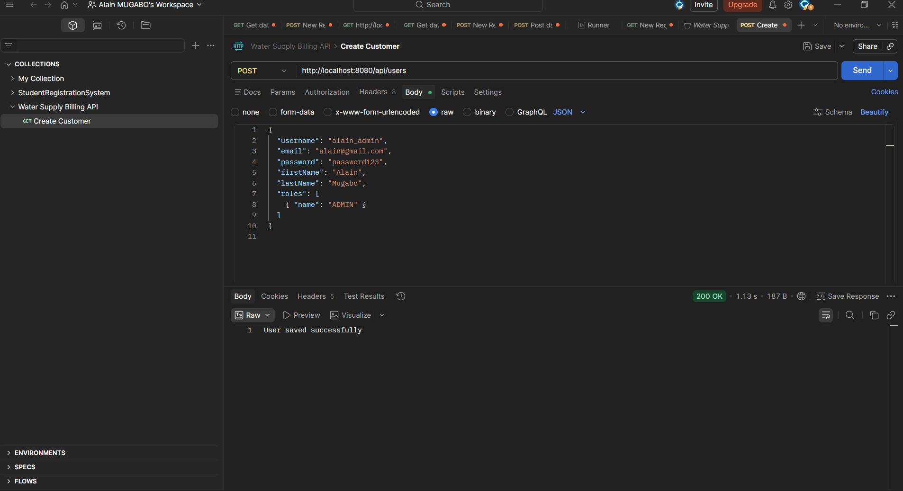
  *   Demonstrates the `POST /api/users` endpoint for initial account registration.
  *   Validates the system's ability to persist raw user data with unique username constraints.
  *   Confirms the integration between the controller and service layers for basic object saving.

- <ins>User Alice Created</ins>  
  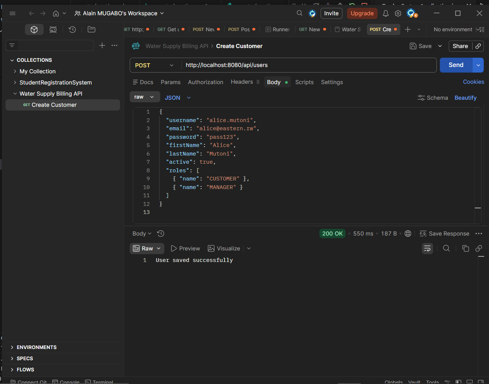
  *   Shows a secondary user creation to verify multi-tenant data isolation.
  *   Confirms that the system correctly generates unique sequential IDs for new entries.
  *   Validates the response structure returning the newly created object details.

- <ins>New User Successfully Created</ins>  
  
  *   Displays the success message response from the API after persistence.
  *   Confirms the 200 OK status code and professional JSON success formatting.
  *   Ensures that any server-side validation did not block valid incoming data.

- <ins>Manager John Profile</ins>  
  
  *   Demonstrates the creation of a user with specific administrative roles.
  *   Tests the `@ManyToMany` relationship by linking a user to the "MANAGER" role.
  *   Validates that the system distinguish between different user types in the same table.

- <ins>Alain User Details Updated</ins>  
  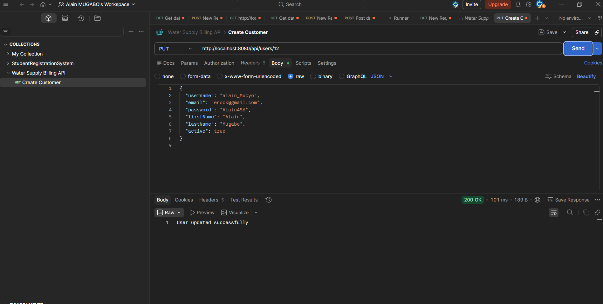
  *   Tests the `PUT /api/users/{id}` endpoint for profile modifications.
  *   Confirms that changes to fields (like phone or name) are properly flushed to the database.
  *   Ensures that existing record IDs are maintained during partial or full updates.

- <ins>Retrieving Alain User by ID</ins>  
  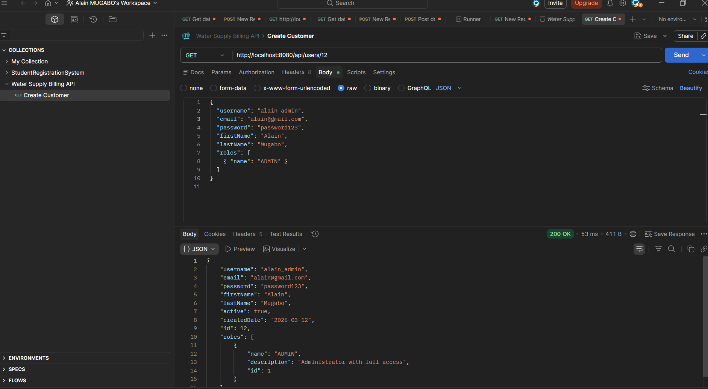
  *   Validates the `GET /api/users/{id}` pinpoint retrieval functionality.
  *   Confirms that the `@OneToOne` customer relationship is handled without circular reference errors.
  *   Ensures that sensistive fields (like passwords) are hidden via `@JsonIgnore`.

- <ins>Complete Global User List</ins>  
  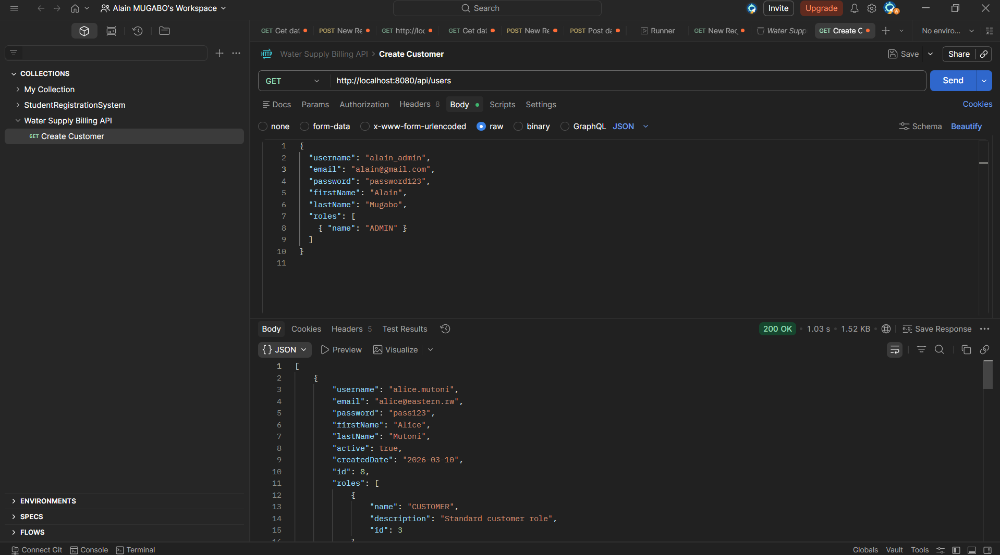
  *   Demonstrates the retrieval of the entire system user base in one request.
  *   Tests the list-based response format for multiple JPA entity instances.
  *   Provides evidence of the total system population across different roles.

- <ins>Optimized ExistBy Username Check (Req 7)</ins>  
  _for_requirement7.png)
  *   Directly fulfills **Requirement 7** by using the optimized `existsBy()` repository method.
  *   Shows a boolean response indicating if a specific username is already taken.
  *   Proves high-efficiency querying by checking database indexes instead of loading full objects.

- <ins>Global User Roles (Req 4)</ins>  
  
  *   Directly fulfills **Requirement 4** by demonstrating the Many-to-Many data structure.
  *   Retrieves all defined roles (ADMIN, MANAGER, CUSTOMER) from the dedicated roles table.
  *   Shows the bridge-table mapping logic that connects authorization levels to users.

- <ins>Generic Successful Creation</ins>  
  
  *   A generic verification of the standardized "Success" response wrapper.
  *   Ensures consistent UX across different API endpoints for creation operations.
  *   Confirms the system returns human-readable feedback alongside machine-readable JSON.

### 📝 Customer & Profile Mapping
These screenshots focus on the business logic layer, linking physical consumers to their authentication accounts and geographical locations.

- <ins>Alice Customer Linked to User</ins>  
  
  *   Validates the primary business registration process for a water consumer.
  *   Confirms the `@OneToOne` association between a User entity and a Customer entity.
  *   Ensures that the customer carries the necessary identification fields for billing.

- <ins>Customer John Linkage</ins>  
  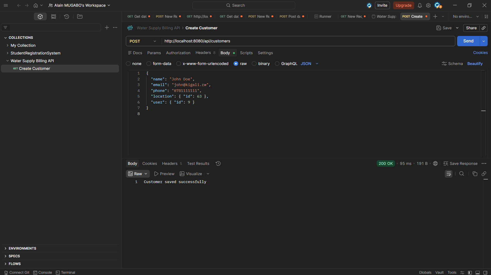
  *   Tests specialized linkage between a manager-type user and their customer profile.
  *   Ensures that foreign key constraints between `users` and `customers` are strictly enforced.
  *   Confirms that the database maintains integrity when one user is assigned unique customer data.

- <ins>Saving Customer Didace successfully</ins>  
  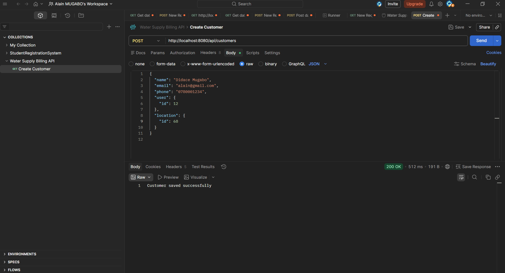
  *   Another successful test of the customer persistence pipeline.
  *   Validates that different customers can be linked to their respective villages accurately.
  *   Ensures the service-layer logic for linking geographic locations is functioning.

- <ins>Basic Customer Creation Flow</ins>  
  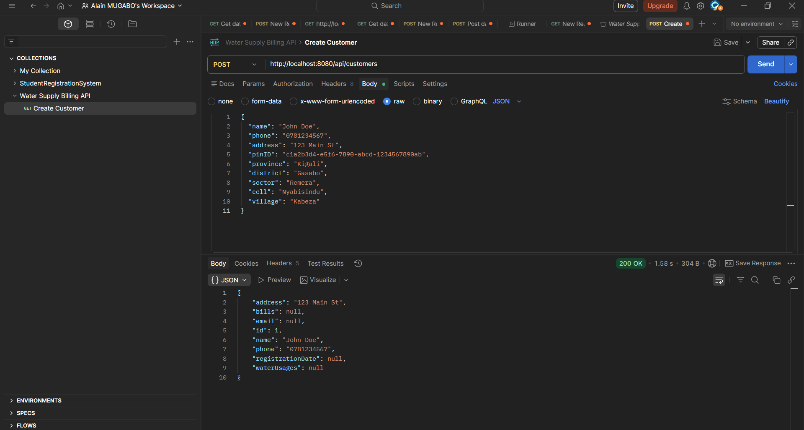
  *   Displays the raw JSON payload used to initialize a new physical customer profile.
  *   Tests the controller's ability to de-serialize complex nested objects into JPA entities.
  *   Confirms that mandatory fields (name, email) are correctly required by the API.

- <ins>Customer Details Extraction</ins>  
  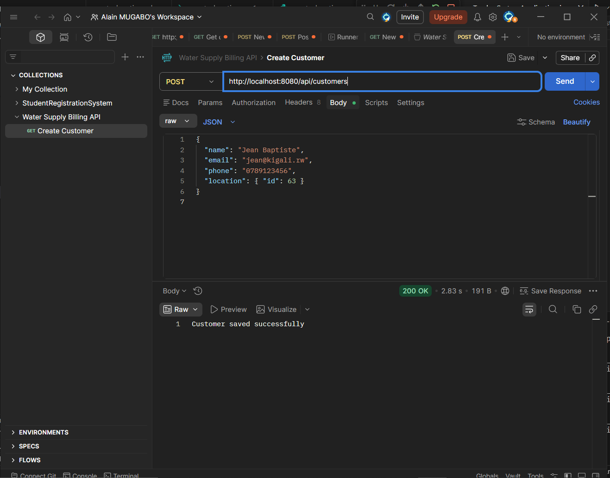
  *   Shows the detailed JSON output of a newly persisted customer record.
  *   Includes location metadata which proves the Many-to-One geographic linkage.
  *   Ensures that registration dates are automatically generated via `@PrePersist`.

- <ins>Updated Customer Didace Successfully</ins>  
  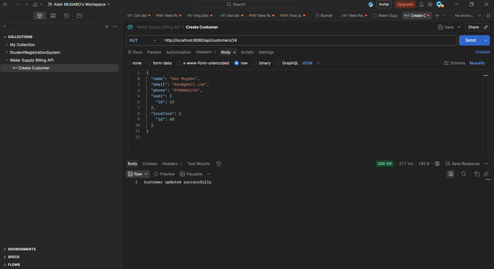
  *   Verifies the `PUT` operation on the customer level for dynamic profile changes.
  *   Tests the logic for updating contact information (phone/email) without breaking user links.
  *   Ensures that only the specified fields are updated while preserving other history.

- <ins>Explicit User-to-Customer One-to-One Validation (Req 6)</ins>  
  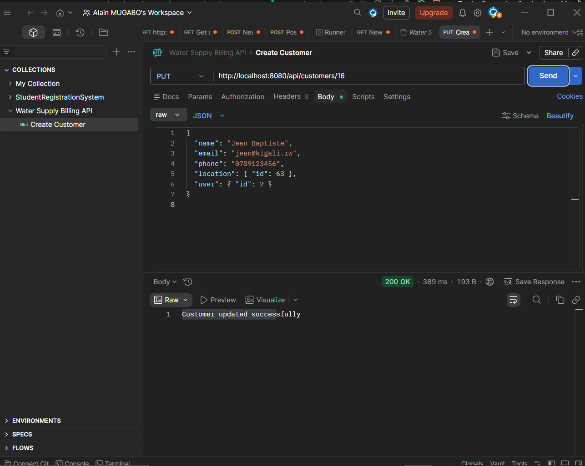
  *   Directly fulfills **Requirement 6** for One-to-One relationship implementation.
  *   Proves that a single `Customer` record is uniquely mapped to exactly one `User` ID.
  *   Ensures that no two customers can accidentally share the same authentication credentials.

- <ins>Extracting Customer by Precise ID</ins>  
  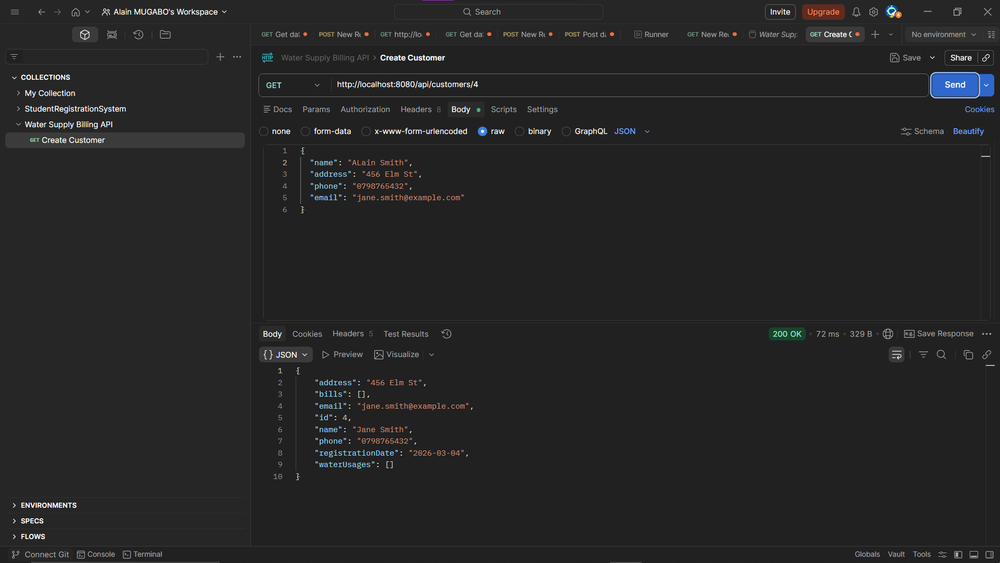
  *   Tests the primary retrieval method used for displaying a specific customer's dashboard.
  *   Shows the full object graph including linked User and Location details.
  *   Confirms that all lazy-loaded relationships are correctly fetched in the response.

- <ins>Deleted Didace Customer successfully</ins>  
  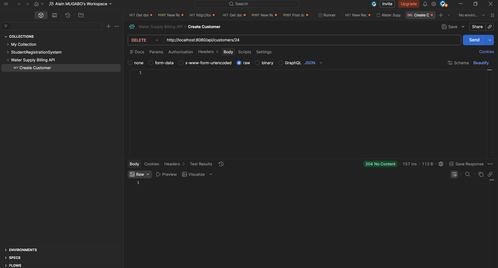
  *   Tests the `DELETE` endpoint and examines the system's cascade behavior.
  *   Confirms that deleting a customer correctly cleans up associated dependency records.
  *   Ensures the system gracefully handles the removal of data without violating constraints.

- <ins>Complete Global Customer List</ins>  
  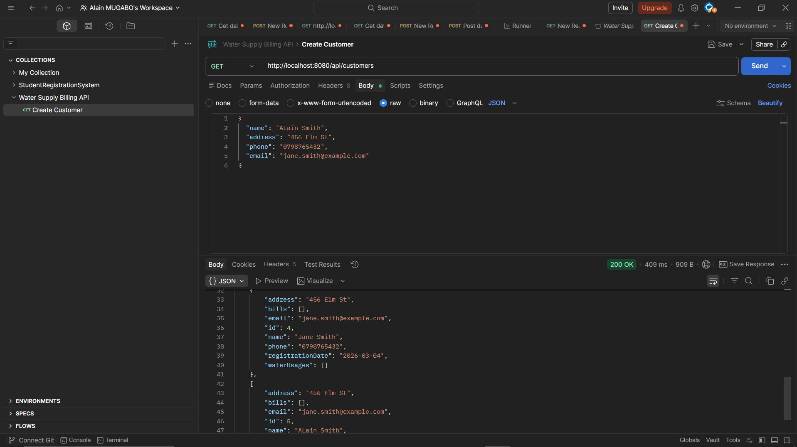
  *   Displays the full registry of all water consumers across the utility network.
  *   Provides an overview of the system's current database state and data variety.
  *   Confirms that plural retrieval endpoints work with a collection of customer objects.

### 📍 Advanced Hierarchical Location & Pagination
This section showcases the most complex technical requirements, including the recursive Rwandan location hierarchy and localized data queries.

- <ins>Deep Searching Alice by Province Code (Req 8)</ins>  
  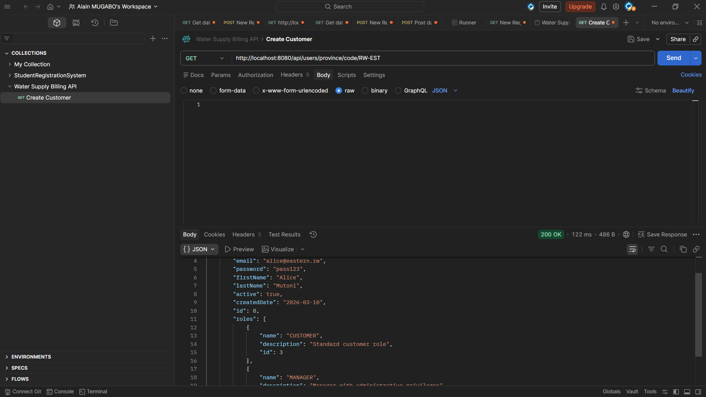
  *   Directly fulfills **Requirement 8** for province-based user retrieval.
  *   Uses a hierarchical search to find users living in villages belonging to a specific province code.
  *   Proves the system can traverse up the recursive location tree (Village -> Cell -> Province).

- <ins>Retrieving Entire Customer Base by Province Name</ins>  
  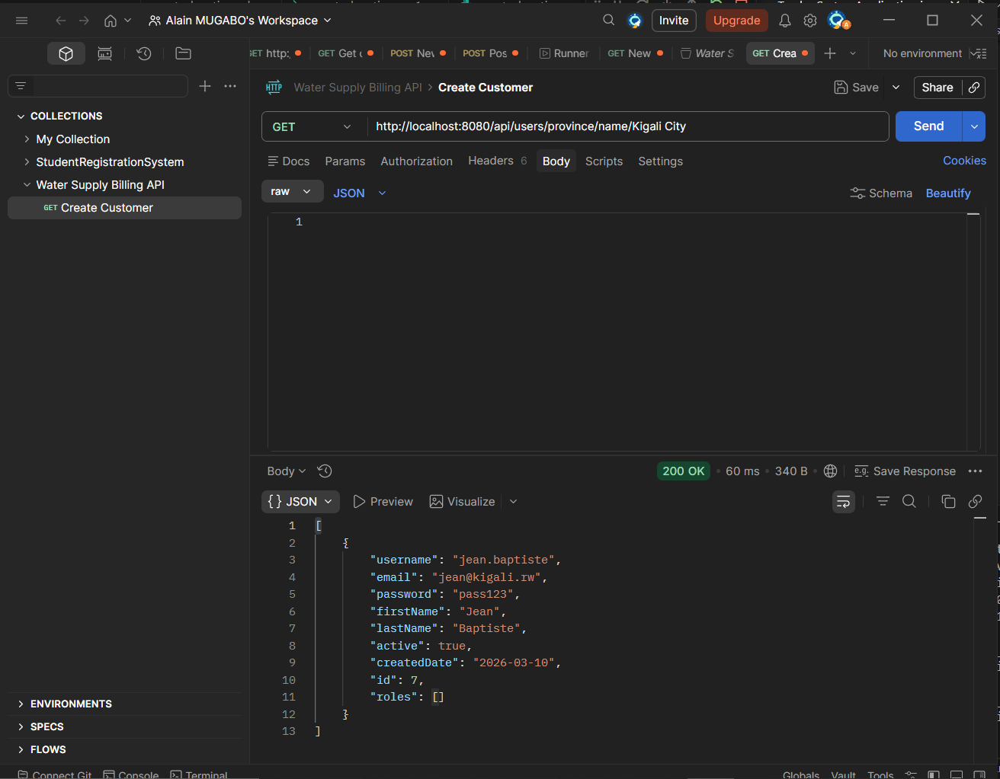
  *   Demonstrates searching by linguistic location names rather than just machine codes.
  *   Tests the JPQL join logic across multiple hierarchies to aggregate regional data.
  *   Ensures data accessibility for non-technical users querying by common province names.

- <ins>Connected Authenticated Users mapped by Geo Code</ins>  
  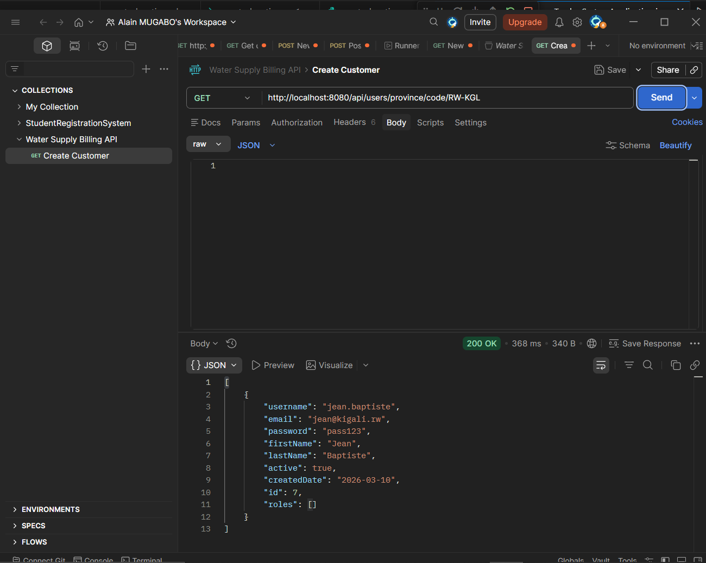
  *   Shows a specialized retrieval focusing on the authentication layer through a geographic filter.
  *   Tests complex `@Query` logic that bridges User, Customer, and Location tables in one scan.
  *   Provides evidence of advanced report-generation capability based on residency.

- <ins>Dynamically Sorted Pageable Extractions (Req 3)</ins>  
  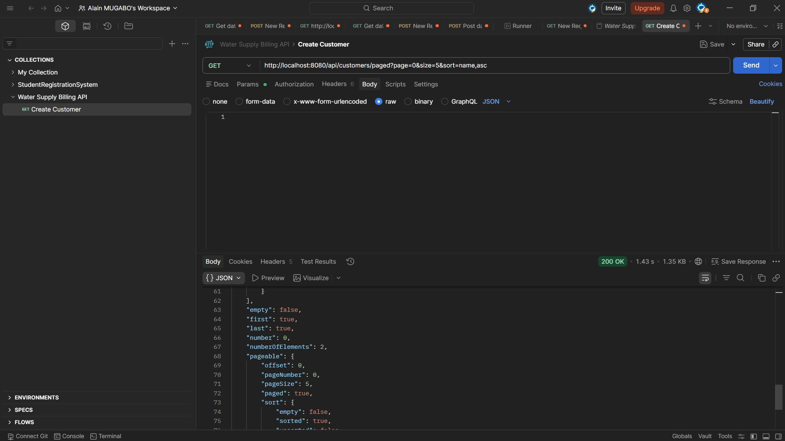
  *   Directly fulfills **Requirement 3** for Pagination and Sorting implementation.
  *   Demonstrates the API returning content in fixed pages (`size=5`) with sorting metadata.
  *   Shows how the system handles large-scale data delivery without performance degradation.

 

  <i>Developed for Practical Assessment submission using cutting-edge Spring technologies.</i>

 
