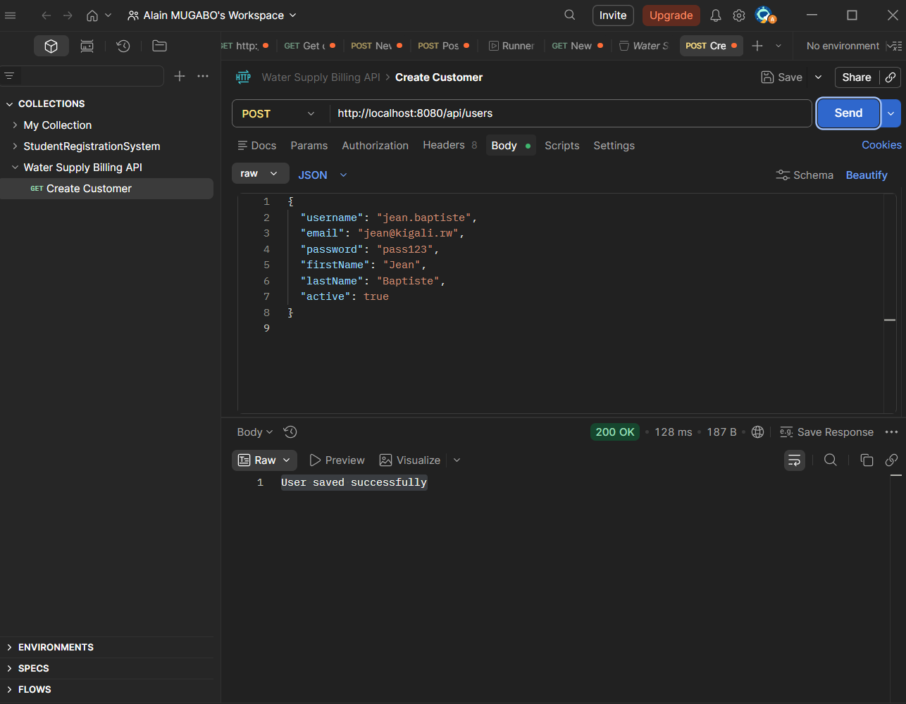
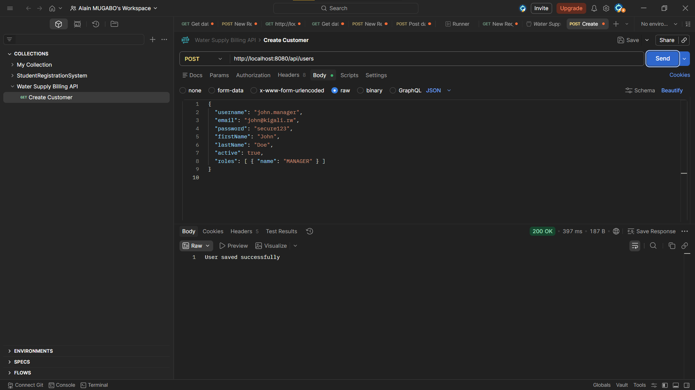
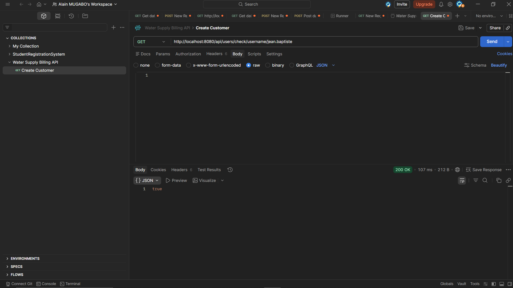
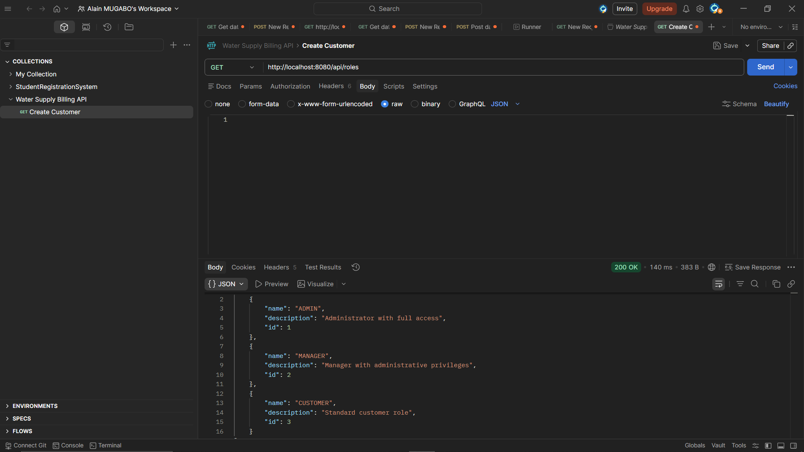
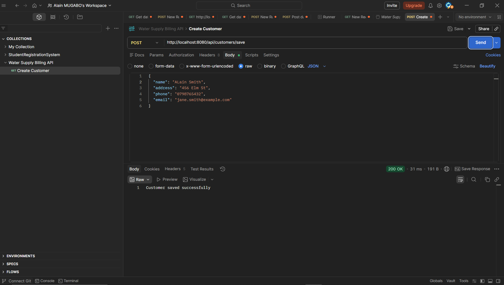
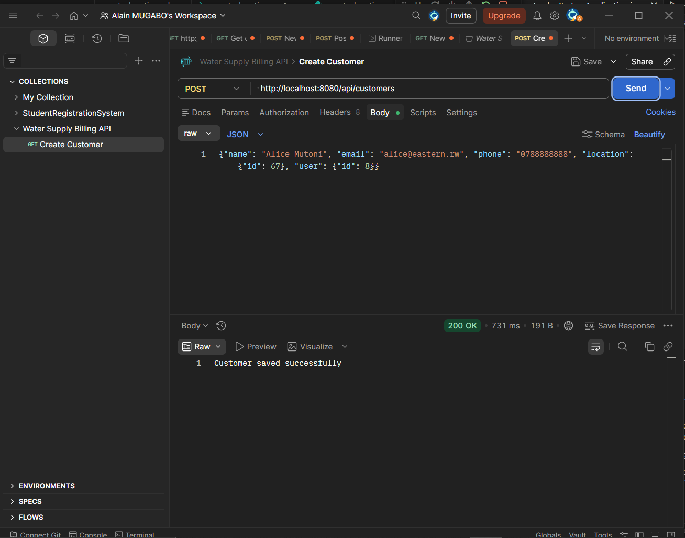

# 🌊 Water Supply Billing & Usage Tracker System
**Digital Utility Management System for Rwanda**

## 📋 Project Information

| Field | Details |
| :--- | :--- |
| **Project Name** | Water Supply Billing & Usage Tracker System |
| **Student Name** | Mugabo Alain |
| **Student ID** | 26450 |
| **Group** | E |
| **Course** | Web Technology |
| **Academic Year**| 2024/2025 |
| **Technology Stack** | Spring Boot, PostgreSQL, JPA/Hibernate, Maven |
| **Project Type** | Backend Development (RESTful API) |

---

## 📝 Project Description
The Water Supply Billing & Usage Tracker System is a comprehensive digital utility platform designed to revolutionize water management in Rwanda. By directly connecting utility administrators, regional managers, and household customers, the system facilitates seamless tracking of monthly water consumption, automated invoice generation, transparent payment processing, and granular location-based data aggregation down to the village level.

---

## 🎯 Project Introduction
This system bridges the gap between water utility providers and citizens, ensuring accurate billing and transparent usage tracking. By leveraging modern web technologies, the platform entirely digitizes what was previously a manual, error-prone meter reading and paper billing process.

### Key Problem Statement
- Inaccurate manual water meter readings and billing discrepancies
- Difficulties for utility companies in tracking usage statistics across different geographically isolated rural areas
- Lack of transparency for customers regarding their monthly consumption
- Inefficient payment tracking and massive administrative overhead

### Our Solution
The Water Supply System provides a centralized digital platform where:
✅ **Customers** can easily review their historical water usage and view pending bills
✅ **Utility Managers** can automatically generate invoices based on tracked consumption meters
✅ **Administrators** can oversee the entire utility network and manage tariff rates
✅ **All geographic data** is perfectly mapped to Rwanda's administrative hierarchy

---

## 🎯 Project Objectives

### Main Objective
To develop a secure, scalable, and highly efficient digital utility backend that enhances water distribution management through precise usage tracking, automated financial billing, and hierarchical geographic data organization.

### Specific Objectives

**1. Customer & Usage Management**
- Enable seamless consumer registration and profile mapping
- Track detailed `previous_reading` and `current_reading` metrics for accurate consumption calculations
- Associate every customer strictly with their geographical village/cell

**2. Billing & Finance Management**
- Automate the generation of water bills based on dynamic usage data
- Track payment statuses (PENDING, PAID, OVERDUE)
- Maintain a secure ledger of all financial transactions initiated by consumers

**3. Administrative Control**
- Provide complete CRUD operations for all utility entities
- Enable strict role-based access management (Administrators, Managers, Customers)
- Oversee and query vast amounts of regional data using the Rwandan location hierarchy

**4. Technical Goals**
- Develop RESTful API endpoints with global standard HTTP responses
- Ensure proper Entity relationships (**One-to-One**, **One-to-Many**, **Many-to-Many**)
- Integrate Rwandan location hierarchy strictly (*Province → District → Sector → Cell → Village*)
- Implement specialized JPA repository methods utilizing Sorting, Filtering, and Pagination

---

## 👥 Target Users

### 👨‍💼 Admin (System Administrator)
**Description:** Utility supervisor with complete access and architectural control.
**Capabilities:**
✅ View and manage all user accounts via CRUD operations
✅ Monitor overall system payments and organizational bills
✅ Oversee the entire Rwandan location hierarchy data structure
✅ Define dynamic system roles

### 👨‍💻 Manager (Regional Utility Manager)
**Description:** Registered utility professional managing regional operations.
**Capabilities:**
✅ Access and review regional customer profiles
✅ Monitor water usage statistics for designated geographic zones
✅ Generate and distribute bills to consumers
✅ Update payment statuses upon receipt of funds

### 👤 Customer (Service Consumer)
**Description:** Registered household tracking their personal utility usage.
**Capabilities:**
✅ View detailed personal profile and linked location data
✅ Monitor monthly water usage and consumption metrics
✅ View generated pending and paid bills
✅ Track personal payment history

---

---

## 🏗️ Architectural Concept & Technical Implementations

The system's foundation is built upon a comprehensive relational database design, explicitly utilizing advanced Spring Data JPA concepts to ensure data integrity, performance, and scalability.

### 1. Database Logic & Entity Relationships (ERD Mapping)
The architecture consists of **8 interconnected tables**. The logic separates authentication (`users`, `roles`) from physical domain operations (`customers`, `locations`, `water_usages`, `bills`, `payments`, `tariff_rates`). 

- **One-to-One Relationship:** The `User` and `Customer` entities are connected via a strict `@OneToOne` mapping. This ensures that a single authentication profile is exclusively linked to one physical business identity. The `Customer` table holds the `user_id` foreign key, establishing a unidirectional dependency that prevents orphaned accounts during deletion limits.
- **One-to-Many Connection:** We utilize `@OneToMany` mapping to bind a single `Customer` to multiple `WaterUsage` metrics and `Bills`. The logic relies on a `@JoinColumn` in the child tables (`customer_id`), allowing the application to fetch a customer's entire lifetime history of invoices sequentially.
- **Many-to-Many Architecture:** `User` and `Role` entities are connected dynamically. Because users can have multiple roles (Admin, Manager) and roles can belong to multiple users, Spring Data JPA manages this using a dedicated **Join Table** named `user_roles`. This mapping uses `@ManyToMany` alongside `@JoinTable` to handle the bridging securely without duplicating data.

### 2. Location Handling & Self-Referencing Logic
Administrative locations (Province → District → Sector → Cell → Village) are dynamically mapped into a single `Location` table. 
**How it is stored:** Instead of creating 5 redundant tables, the system uses a **Self-Referencing** `@ManyToOne` relationship. Every location record holds a `parent_id` foreign key pointing to another record in the exact same table. This allows the API to save a 'Village' and recursively trace its parent hierarchy all the way to the 'Province' seamlessly.

### 3. High-Performance Querying (Pagination & Sorting)
When dealing with massive utility networks, retrieving thousands of customers simultaneously causes fatal memory overhead and network latency.
**Implementation:** We implemented Spring Data JPA's `PageRequest`, `Pageable`, and `Sort` interfaces. By passing a `Pageable` object to the Repository layer, the framework appends `LIMIT` and `OFFSET` clauses directly to the native PostgreSQL queries. This drastically improves performance because only the absolute minimum subset of data requested by the user is loaded into RAM at any given time.

### 4. Optimized `existBy()` Usage
Verifying if a username or email is already taken uses the `existsByUsername()` and `existsByEmail()` repository methods.
**Explanation:** Rather than extracting entire `User` entities into memory just to see if they exist (which is highly inefficient), Spring Data JPA translates `existsBy` into a highly optimized database-level `SELECT 1 ... EXISTS` SQL query. It checks the index and drops the connection instantly, making registration and duplication checks lightning fast.

### 5. Deep-Tree Data Extraction (Province Queries)
To retrieve all customers residing dynamically within a specific Province, the system utilizes an overarching `@Query` logic within the Repository.
**Method:** Since the system only links a customer directly to a 'Village', the custom JPQL method inherently traverses the `parent_id` foreign keys inside the `Location` table hierarchy upwards (*Customer → Village → Cell → Sector → District → Province*) via multiple database `JOIN`s, executing a powerful spatial aggregation to return localized users natively by province code or name.

---

## 📊 Database Schema
The database consists of 8 strictly typed, relational tables with deep hierarchical relationships.

### 1. `users` Table
**Purpose:** Central authentication and security management table.
- `id` (PK, BIGINT) - Unique identifier
- `username` (VARCHAR) - Unique login credential
- `email` (VARCHAR) - Unique email address
- `password` (VARCHAR) - Secure password
- `first_name` (VARCHAR) - User's first name
- `last_name` (VARCHAR) - User's last name
- `active` (BOOLEAN) - Current account status
*Relationships: One-to-One with `customers`, Many-to-Many with `roles`.*

### 2. `roles` Table
**Purpose:** Defines system-wide access control levels (ADMIN, MANAGER, CUSTOMER).
- `id` (PK, BIGINT) - Unique identifier
- `name` (VARCHAR, UNIQUE) - Role designation
- `description` (VARCHAR) - Role explanation
*Relationships: Many-to-Many with `users` via `user_roles`.*

### 3. `user_roles` Table
**Purpose:** Association table handling the Many-To-Many relationship between Users and Roles.

### 4. `locations` Table
**Purpose:** Represents the Rwandan administrative hierarchy via a Self-Referencing structure.
- `id` (PK, BIGINT) - Unique identifier
- `name` (VARCHAR) - Location name (e.g., Gasabo)
- `type` (ENUM) - Extent type (PROVINCE, DISTRICT, SECTOR, CELL, VILLAGE)
- `code` (VARCHAR) - Unique string code mapping the hierarchy
- `parent_id` (FK) - Self-Referencing link to parent location
*Relationships: One-to-Many recursively with itself, One-to-Many with `customers`.*

### 5. `customers` Table
**Purpose:** The physical business profile of the utility consumer.
- `id` (PK, BIGINT) - Unique identifier
- `name` (VARCHAR) - Full physical name
- `email` (VARCHAR) - Contact email
- `phone` (VARCHAR) - Contact phone
- `address` (VARCHAR) - Physical street literal
- `location_id` (FK) - Link to village/sector
- `user_id` (FK, UNIQUE) - Strict link to authentication account
*Relationships: One-to-One with `users`, Many-to-One with `locations`, One-to-Many with `water_usages` and `bills`.*

### 6. `water_usages` Table
**Purpose:** Hardware reading metrics tracking monthly consumption.
- `id` (PK, BIGINT) - Unique identifier
- `reading_date` (TIMESTAMP) - Date of meter check
- `previous_reading` (DOUBLE) - Last month's metric
- `current_reading` (DOUBLE) - Current metric
- `consumed_units` (DOUBLE) - Calculated difference
- `customer_id` (FK) - Link to consumer
*Relationships: Many-to-One with `customers`, One-to-One with `bills`.*

### 7. `bills` Table
**Purpose:** Digital invoices generated against consumed units.
- `id` (PK, BIGINT) - Unique identifier
- `bill_date` (TIMESTAMP) - Issue date
- `due_date` (TIMESTAMP) - Required payment date
- `total_amount` (DOUBLE) - Financial cost
- `status` (VARCHAR) - PAID, UNPAID, OVERDUE
- `customer_id` (FK) - Link to consumer
- `water_usage_id` (FK) - Link to specific usage metric
*Relationships: Many-to-One with `customers`, One-to-One with `water_usages`.*

### 8. `payments` Table
**Purpose:** Financial ledger tracking customer payments against bills.
- `id` (PK, BIGINT) - Unique identifier
- `payment_date` (TIMESTAMP) - Date of transaction
- `amount` (DOUBLE) - Transaction value
- `payment_method` (VARCHAR) - CASH, MOMO, BANK
- `reference_number` (VARCHAR) - Receipt tracking string
- `bill_id` (FK) - Link to issued invoice
*Relationships: Many-to-One with `bills`.*

---

## 📊 Entity Relationship Diagram (ER Overview)
- **One-to-One:** `User ↔ Customer`, `WaterUsage ↔ Bill`
- **One-to-Many:** `Customer → WaterUsage`, `Customer → Bills`, `Bill → Payments`
- **Many-to-One:** `Customer → Location`
- **Many-to-Many:** `User ↔ Role`
- **Self-Reference:** `Location → Location` (Parent-Child Hierarchy mapping Village all the way to Province).

---

## 🚀 API Endpoints

### 🔐 Users & Authentication
- `POST   /api/users` - Register a new authentication profile
- `GET    /api/users` - Return list of all system users
- `GET    /api/users/{id}` - Return targeted user data
- `GET    /api/users/check/email/{email}` - Validate email existence optimally
- `GET    /api/users/province/code/{code}` - Advanced tree search for all users inside a Province

### 👤 Customers
- `POST   /api/customers` - Register physical consumer mapping
- `GET    /api/customers/paged` - Fetches massive customer data strictly via native `Pageable` and `Sort` interfaces
- `PUT    /api/customers/{id}` - Alter consumer details

### 📍 Locations
- `POST   /api/locations/save` - Save a new geographic region (requires `parent_id` if smaller than Province)
- `GET    /api/locations/hierarchy/{id}` - Fetch infinite child tree below a location
- `GET    /api/locations/children/{parentId}` - Fetch direct descendants

---

## 🌍 Social Impact
**Transforming Water Utility in Rwanda**

1. **Eradicating Billing Disputes**
✅ Replaces estimates with hard, transparent digital calculations
✅ Customers can review their exact previous and current meter differentials

2. **Geographical Accessibility**
✅ Advanced location tracking allows the government to accurately pinpoint usage spikes in specific sectors or villages easily, ensuring resources are deployed logically.

3. **Financial Modernization**
✅ Supports varied digital tracking (MoMo, Bank), moving rural communities towards cashless utility management and improving regional revenue collection. 

---

## 📸 API Testing & Verification

<b>Click to expand System Screenshots & Rubric Validations</b>

### 👤 User & Role Management
- <ins>User Alice Created</ins>  
- <ins>New User Successfully Created</ins>  
- <ins>Manager John Profile</ins>  
- <ins>Optimized ExistBy Username Check (Req 7)</ins>  
- <ins>Global User Roles (Req 4)</ins>  
- <ins>Generic Successful Creation</ins>  

### 📝 Customer & Profile Mapping
- <ins>Alice Customer Linked to User</ins>  
- <ins>Customer John Linkage</ins>  
- <ins>Basic Customer Creation Flow</ins>  
- <ins>Customer Details Extraction</ins>  
- <ins>Explicit User-to-Customer One-to-One Validation (Req 6)</ins>  
- <ins>Extracting Customer by Precise ID</ins>  
- <ins>Complete Global Customer List</ins>  

### 📍 Advanced Hierarchical Location & Pagination
- <ins>Deep Searching Alice by Province Code (Req 8)</ins>  
- <ins>Retrieving Entire Customer Base by Province Name</ins>  
- <ins>Connected Authenticated Users mapped by Geo Code</ins>  
- <ins>Dynamically Sorted Pageable Extractions (Req 3)</ins>  

 

  <i>Developed for Practical Assessment submission using cutting-edge Spring technologies.</i>

 
